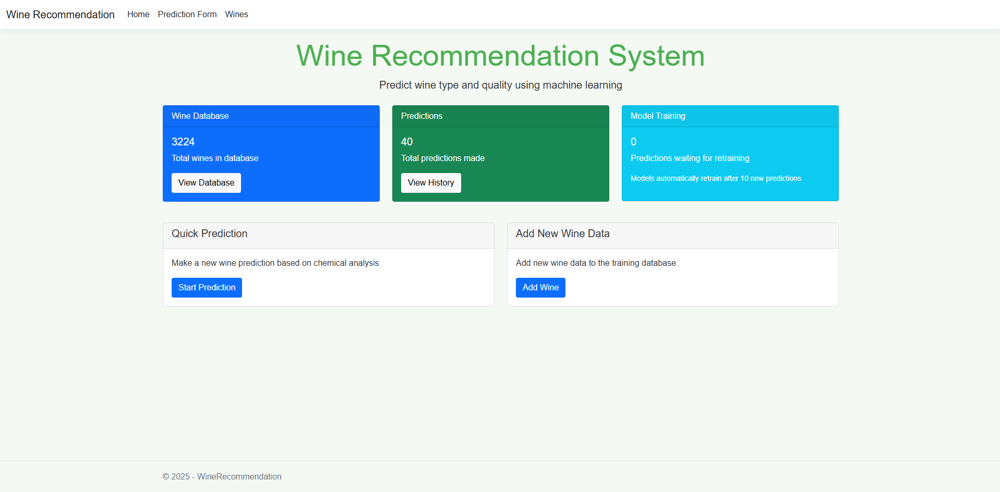
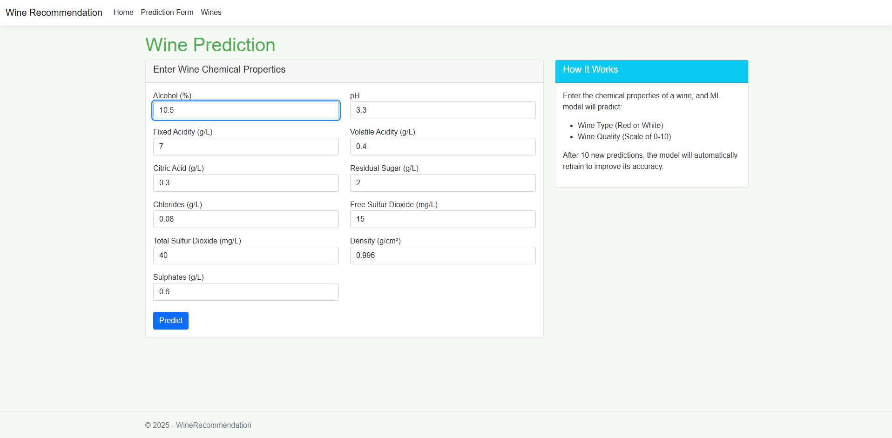
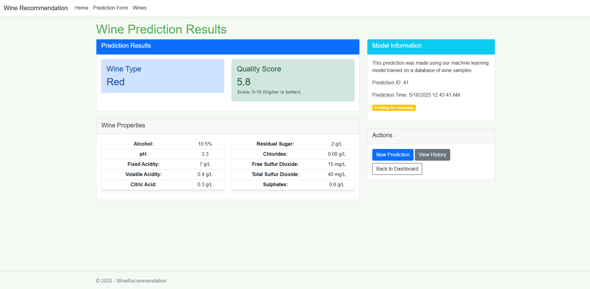
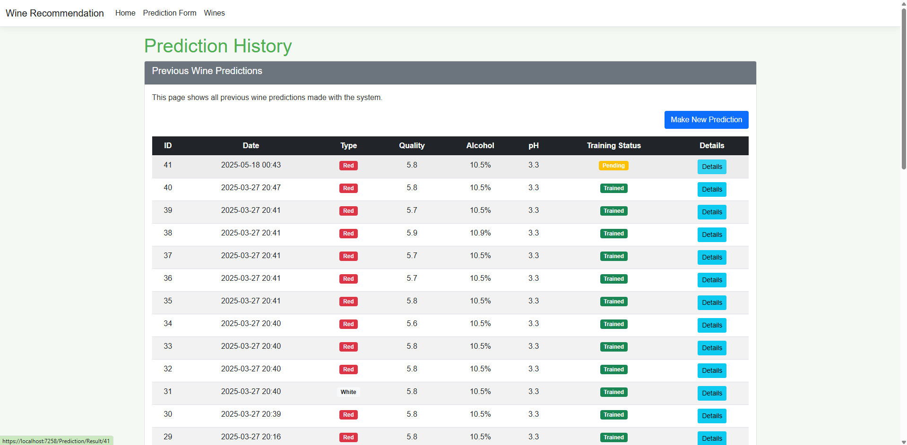

# 🍷 WineRecommendation

A wine recommendation system using machine learning built on ASP.NET Core 8.0 Razor Pages.

## 🌟 Project overview

The project is a web application for analysing and predicting wine characteristics. The system uses ML.NET to create machine learning models that can:
- Determine the type of wine (red or white)
- Predict the quality of wine based on its chemical properties

## 🛠 Technology

- ASP.NET Core 8.0 Razor Pages
- Entity Framework Core 9.0
- ML.NET 4.0
- SQLite
- CsvHelper
- JavaScript/HTML/CSS

## 📋 Functionality

- Import wine data from CSV files
- Training ML models for wine type classification and quality prediction
- Training data balancing to improve model accuracy
- Evaluation of model accuracy on test data
- Ability to retrain models with new data (every 10 instances)
- Implementation of CRUD operations for convenient database management

## 📊 Dataset used

The project uses the [Wine Quality Dataset] (https://archive.ics.uci.edu/dataset/186/wine+quality) from the UCI Machine Learning Repository. The dataset contains information on Vinho Verde red and white wines from Portugal, including:
- 1599 red wine samples
- 4898 samples of white wine

The dataset contains the physicochemical characteristics of red and white wine samples from Portugal, as well as their sensory quality score on a scale from 0 to 10.

## 🤖 Machine Learning Models

This project uses two ML.NET trained models for classification and regression tasks.

### 1. 🍷 Wine Type Classification

- **Algorithm**: `SdcaMaximumEntropy`
- **Input Features**: Alcohol, pH, Residual Sugar, Fixed Acidity, Volatile Acidity, Citric Acid, Chlorides, Density
- **Output**: Wine type – Red or White

### 2. 🧪 Wine Quality Prediction

- **Algorithm**: `FastTree` (Gradient Boosted Decision Trees)
- **Input Features**: Alcohol, pH, Residual Sugar, Volatile Acidity, Citric Acid, Sulphates, Fixed Acidity, Chlorides, Density
- **Output**: Quality score (0-10)

## ⚙️ Data Processing & Evaluation

- Automatic class balancing (red vs white)
- Train-test split: 80% training / 20% testing
- Model evaluation:
    - **Classification**: Micro & Macro Accuracy
    - **Regression**: MAE, MSE, R² (R-Squared)
- Supports retraining with new data
> _Metrics are recalculated with each retraining cycle._

## 📸 Usage Screenshots

### 🏠 Home Page


*Home page with general statistics and the ability to start analysing wine*

---

### 🧪 Entering Wine Characteristics


*Form for entering chemical characteristics of wine for analysis*

---

### 📊 Forecasting Results


*Page with the results of wine type and quality prediction*

---

### 🕒 History of Forecasts


*Page with the history of previous forecasts and their results*


## 🚀 Getting started

### Prerequisites

- .NET 8.0 SDK
- Visual Studio 2022 or later
- SQLite database
### Installation

1. Clone the repository:
```bash
git clone https://github.com/LarLex001/WineRecommendation.git
```

2. Go to the project directory:
```bash
cd WineRecommendation
```

3. Restore the dependencies and run the project:
```bash
dotnet restore dotnet run
```

## 📝 Licence

This project is licensed under the MIT License - see the [LICENSE](LICENSE) file for details.